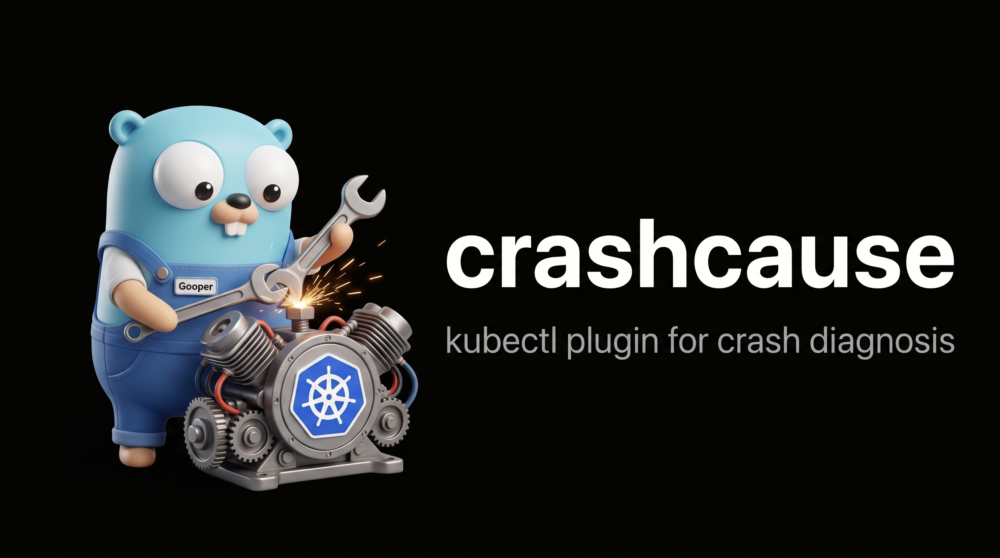

# crashcause



**Find out why a Kubernetes pod crashed, straight from live cluster state.**

No `kubectl describe`, no `kubectl logs --previous`, no pasting output into anything. crashcause
reads the pod's status, events, previous-container logs and node conditions itself, and names the
cause as one of 18 stable cause codes: `oom_killed`, `probe_liveness_failure`,
`config_missing_reference` and so on.

It runs two ways. `crashcause inspect` is a kubectl plugin that diagnoses one pod on demand.
`crashcause watch` is an in-cluster controller that turns every crash in the cluster into a
Prometheus label and a structured log line for Loki and Grafana.

[](https://github.com/ryckakas/crashcause/actions/workflows/ci.yml)
[](https://github.com/ryckakas/crashcause/releases/latest)


Pre-1.0: flags and chart values may still change between minor versions. The 18 cause codes are
the stable part of the contract.

## Why this one

- **No copy-paste.** It talks to the Kubernetes API directly and collects the evidence itself.
  Point it at one pod, or at the whole cluster.
- **The cause becomes a metric label.** kube-state-metrics tells you a pod is in
  `CrashLoopBackOff`. crashcause tells you why, as `cause="oom_killed"`, which you can filter,
  graph and alert on in Grafana with no extra tooling.
- **Stable codes, not prose.** Every diagnosis resolves to one of 18 snake_case codes, and a
  released code never changes meaning.
- **Normal deploys stay quiet.** A SIGTERM (exit 143) during a rolling update, scale-down or pod
  deletion is ordinary lifecycle, so it is not reported at all.
- **Every permission can be removed.** Turn off log collection and the chart drops the
  `pods/log` RBAC rule entirely. `inspect` needs no RBAC of its own: it runs with your kubeconfig.
- **AI only if you ask.** When the rules land on an application crash they can't explain further,
  `--ai` summarizes the log tail with your own Anthropic, OpenAI or Ollama key. Off by default,
  and fail-closed per namespace in `watch`.

## Install

```sh
# kubectl plugin, for inspect
kubectl krew install --manifest-url=https://github.com/ryckakas/crashcause/releases/latest/download/crashcause.yaml

# or from source (any Go 1.21+; the go command fetches the toolchain pinned in go.mod)
go install github.com/ryckakas/crashcause/cmd/crashcause@latest

# in-cluster controller, for watch
helm install crashcause oci://ghcr.io/ryckakas/charts/crashcause -n crashcause --create-namespace
```

crashcause is not in the krew index yet, so `kubectl krew install crashcause` does not work until
the submission is accepted. The manifest URL above always resolves to the newest release, and krew
verifies each archive's sha256 against it.

Prebuilt `linux` and `darwin` archives for `amd64` and `arm64`, with checksums and SBOMs, are
attached to every [release](https://github.com/ryckakas/crashcause/releases). Name the binary
`kubectl-crashcause` to get the `kubectl crashcause` form without krew.

<details>
<summary><b>Helm: values files and notable keys</b></summary>

Helm installs the newest chart version; add `--version X.Y.Z` to pin one.
`helm show values oci://ghcr.io/ryckakas/charts/crashcause` prints every default, and
[`charts/crashcause/README.md`](./charts/crashcause/README.md) is the full values reference. To
try chart changes from a checkout:

```sh
helm install crashcause ./charts/crashcause -n crashcause --create-namespace -f my-values.yaml
```

A minimal values file, watching everything with the default sinks:

```yaml
# my-values.yaml
watch:
  namespaces: []          # empty = all namespaces
  reemitInterval: 1h
  dedupTTL: 6h

logCollection:
  enabled: true
  rateLimitPerMinute: 10

metrics:
  enabled: true
  addr: ":9090"
```

A locked-down one. `logCollection.enabled: false` does not just switch log reading off: it removes
the `pods/log` verb from the chart's ClusterRole, so the controller cannot read logs at all.

```yaml
# my-values.locked-down.yaml
watch:
  namespaces: ["payments", "checkout"]
  selector: "team=platform"

logCollection:
  enabled: false          # controller CANNOT read pod logs; RBAC rule is omitted

ai:
  enabled: false

metrics:
  enabled: true
  addr: ":9090"

serviceMonitor:
  enabled: false
```

Notable keys: `watch.namespaces`, `watch.selector`, `watch.reemitInterval`, `watch.dedupTTL`,
`watch.previousLines`, `watch.initStuckThreshold`, `logCollection.enabled`,
`logCollection.namespaces`, `logCollection.rateLimitPerMinute`, `metrics.enabled`, `metrics.addr`,
`serviceMonitor.enabled`, `serviceMonitor.labels`, `serviceMonitor.skipCapabilityCheck`,
`loki.url`, `loki.existingSecret`, `ai.enabled`, `ai.provider`, `ai.url`, `ai.namespaces`,
`ai.redact`, `ai.redactIPs`, `ai.existingSecret`, `ai.secretKey`, `leaderElection.enabled`,
`replicas`.

`ai.namespaces` is empty by default, which means nothing is summarized; `["*"]` opts the whole
cluster in. `serviceMonitor.skipCapabilityCheck` (default `false`) lets `helm template` render the
`ServiceMonitor` offline, for GitOps pipelines that cannot check whether the
`monitoring.coreos.com/v1` CRD is installed. Without it, enabling `serviceMonitor` in an offline
render fails loudly instead of producing a resource the cluster can't accept.

</details>

## Use it

```sh
crashcause inspect my-pod -n shop          # why did this pod crash?
crashcause inspect my-pod -c sidecar       # one container only
crashcause inspect my-pod --verbose        # every rule that matched, not just the primary
crashcause inspect my-pod --output json    # for scripts and CI
crashcause inspect my-pod --ai             # add an AI summary; the key comes from CRASHCAUSE_AI_API_KEY
```

Installed through krew, the same commands start with `kubectl crashcause`.

The report leads with the evidence: cause, confidence, a plain explanation, evidence bullets and
next steps. This one illustrates the format rather than transcribing a real run:

```text
crashcause-demo/oom-demo container app: oom_killed (high confidence)

  Container was OOM-killed: last termination reason was OOMKilled with exit code 137.
  Memory limit was 16Mi.

  Evidence:
    - last state: terminated, reason=OOMKilled, exitCode=137
    - restartCount: 4
    - limit: memory=16Mi

  Next steps:
    - Raise the memory limit or reduce the workload's memory footprint
    - Check node MemoryPressure conditions if this recurs across pods
```

| Exit code | Meaning |
|---|---|
| `0` | Diagnosed: at least one container's crash was classified and reported. |
| `1` | Error: bad flags, unreachable API server, pod or container not found. |
| `2` | Nothing to diagnose: the pod exists but isn't crashing. |

<details>
<summary><b><code>inspect</code> flags</b></summary>

| Flag | Default | Meaning |
|---|---|---|
| `-c, --container` | (unset) | Restrict the diagnosis to one container. By default every container that warrants diagnosis is reported. |
| `--output` | `human` | `human` or `json`. |
| `--previous-lines` | `60` | Lines to fetch from the previous container's log tail. |
| `--init-stuck-threshold` | `10m` | How long an init container may run before it's reported as `init_container_stuck`. |
| `--verbose` | `false` | Report every rule that matched, not just the primary diagnosis. |
| `--ai` | `false` | Enable the optional AI summary (see [AI summaries](#ai-summaries-optional-off-by-default)). |
| `-n, --namespace`, `--kubeconfig`, `--context`, ... | | Standard `k8s.io/cli-runtime` kubeconfig flags, as in kubectl. |
| `--log-level` (root, persistent) | `info` | `debug\|info\|warn\|error`. |

</details>

<details>
<summary><b>The same diagnosis as JSON</b></summary>

`--output json` emits one `Report` document per invocation, with the field names of `Diagnosis`
in `internal/engine/types.go`:

```json
{
  "pod": "oom-demo",
  "namespace": "crashcause-demo",
  "diagnoses": [
    {
      "cause": "oom_killed",
      "confidence": "high",
      "explanation": "Container was OOM-killed: last termination reason was OOMKilled with exit code 137. Memory limit was 16Mi.",
      "evidence": [
        "last state: terminated, reason=OOMKilled, exitCode=137",
        "restartCount: 4",
        "limit: memory=16Mi"
      ],
      "next_steps": [
        "Raise the memory limit or reduce the workload's memory footprint",
        "Check node MemoryPressure conditions if this recurs across pods"
      ],
      "container": "app",
      "pod": "oom-demo",
      "namespace": "crashcause-demo",
      "owner": {"kind": "Deployment", "name": "oom-demo"},
      "timestamp": "2026-08-02T12:00:00Z",
      "ai_summary": null
    }
  ]
}
```

`ai_summary` is always present and is non-null only when `--ai` was passed and the provider call
succeeded. A healthy pod (exit `2`) still gets a well-formed document with `"diagnoses": []`, so
`jq '.diagnoses | length'` never breaks on one.

</details>

## Watch the whole cluster

```sh
crashcause watch [flags]
```

Every diagnosis goes to stdout as one JSON object per line. That sink is always on, so a cluster
that already ships container stdout (promtail, vector, fluent-bit) gets structured crash causes
with nothing else to configure.

- `--metrics-addr` serves two deliberately low-cardinality Prometheus metrics:
  `crashcause_diagnoses_total{namespace, owner_kind, owner_name, cause}` and
  `crashcause_log_fetches_skipped_total`.
- `--loki-url` pushes diagnoses to Loki directly.
- Log-style output is deduplicated per workload, while the Prometheus counter still counts every
  observed crash.

The full sink reference (cardinality, Loki auth and backpressure, the dedup model) is in
[`docs/sinks.md`](./docs/sinks.md). To start from something working, use the example
[Grafana dashboard](./examples/grafana-dashboard.json) and
[Prometheus alert rules](./examples/prometheus-alerts.yaml).

<details>
<summary><b><code>watch</code> flags</b></summary>

| Flag | Default | Meaning |
|---|---|---|
| `--namespaces` | (all) | Namespaces to watch (allowlist). |
| `--selector` | (unset) | Label selector to filter watched pods. |
| `--metrics-addr` | (disabled) | Address to serve `/metrics` on, e.g. `:9090`. Enables the Prometheus sink. |
| `--loki-url` | (disabled) | Loki push URL. Enables the Loki sink. |
| `--reemit-interval` | `1h` | Minimum interval before re-emitting an unchanged diagnosis for the same container. |
| `--dedup-ttl` | `6h` | How long a diagnosis is remembered for dedup purposes. |
| `--collect-logs` | `true` | Whether to fetch previous-container logs at all. |
| `--log-namespaces` | (all) | Namespaces log collection is allowed in. |
| `--log-rate-limit` | `10` | Max pod-log fetches per minute (client-side token bucket). |
| `--previous-lines` | `60` | Log tail length passed to the engine and, if enabled, the AI layer. |
| `--init-stuck-threshold` | `10m` | Same meaning as in `inspect`. |
| `--leader-elect` | `false` | Enable leader election so only one replica is active. |
| `--leader-election-namespace` | `$POD_NAMESPACE`, else `default` | Namespace holding the leader-election Lease. |
| `--leader-election-id` | `crashcause` | Name of the leader-election Lease. |
| `--health-addr` | `:8081` | Address serving `/healthz` and `/readyz`. |
| `--ai-namespaces` | (empty: AI off everywhere) | Namespace allowlist for AI summaries. Empty keeps AI inert in every namespace, even with `--ai` set; pass `"*"` to opt the whole cluster in. |
| `--ai`, `--ai-provider`, `--ai-url`, `--ai-model`, `--ai-timeout`, `--ai-redact`, `--ai-redact-ips`, `--ai-redact-extra` | see [`docs/ai-layer.md`](./docs/ai-layer.md) | Shared AI flags, identical to `inspect`. |

</details>

## Cause codes

Every diagnosis carries one of 18 stable, snake_case cause codes, defined in
`internal/engine/types.go`. They are part of the external contract: once released, a code's
meaning does not change.

<details>
<summary><b>All 18 cause codes and what triggers each</b></summary>

| Cause code | Meaning |
|---|---|
| `oom_killed` | The container's last termination reason was exactly `OOMKilled` (kernel cgroup attribution). Never inferred from a bare exit 137, because usage data can't be recovered from the Kubernetes API after the fact. |
| `sigkill_unattributed` | Exit code 137 (SIGKILL) **without** `reason=OOMKilled` and **without** the pod being deleted. Suspects: a node-level OOM kill that wasn't cgroup-attributed, or an external SIGKILL. |
| `evicted` | Pod status reason is `Evicted`; the eviction message is parsed for the pressured resource (memory, disk or pids). |
| `probe_liveness_failure` | A `Killing` event plus `Unhealthy` (liveness) events: the liveness probe killed the container. |
| `probe_startup_failure` | `Unhealthy` (startup) events plus a restart; flags a too-tight `failureThreshold` x `periodSeconds` against observed startup time when derivable. |
| `image_pull_auth` | `ErrImagePull` or `ImagePullBackOff` with a message matching an authorization failure (401/403, "pull access denied"). |
| `image_pull_not_found` | Image pull failure with a message matching "not found" or "manifest unknown". |
| `image_pull_other` | Any other pull failure: timeout, TLS error, registry quota, and so on. |
| `security_context_violation` | `CreateContainerConfigError` where the kubelet message shows a securityContext rejection, such as `runAsNonRoot: true` against an image that runs as root or declares a non-numeric user. The image pulled fine; a pre-start config check refused the container, so it never started. |
| `config_missing_reference` | `CreateContainerConfigError` because a referenced ConfigMap, Secret or key doesn't exist; the message names which one. securityContext rejections are reported as `security_context_violation` instead. |
| `volume_mount_failure` | `FailedMount` or `FailedAttachVolume` events. |
| `init_container_failure` | An init container terminated non-zero; the failure is re-classified using only the rules that apply to init containers. |
| `init_container_stuck` | An init container has been `Running` for longer than `--init-stuck-threshold` (default 10m) without completing, or `activeDeadlineSeconds` was exceeded. Not a crash: a pod stuck at `Init:N/M`. |
| `unschedulable` | Pod is `Pending`, not yet bound to a node, and has `FailedScheduling` events; the message is parsed to tell insufficient resources, node-affinity mismatch, untolerated taints and volume zone conflicts apart. Needs no logs and no extra RBAC. |
| `app_exit_nonzero` | A clean application-level crash: exit code 1, 2 or another non-zero code with no Kubernetes-side cause. Log-tail patterns (`panic:`, `Fatal`, `ECONNREFUSED`, `OutOfMemoryError`, `MODULE_NOT_FOUND`, segfault/exit 139, and so on) refine the explanation. The main input to the optional AI layer. |
| `sigkill_after_grace` | Exit 137 **on a pod with a `deletionTimestamp` set**: the app did not stop on `SIGTERM` before its termination grace period ran out. Application-only, high confidence. |
| `completed_restart_loop` | Exit code 0 with `restartPolicy: Always` on what looks like a run-to-completion workload, so it keeps "succeeding" and restarting forever. |
| `unknown` | Nothing matched confidently. The evidence collected so far is still reported; the AI layer, if enabled, is the suggested next step. |

Exit 143 during a rolling deploy, scale-down or deletion is **normal pod lifecycle**: the pod has a
`deletionTimestamp`, or its owner is mid rolling update. It is deliberately **not reported**, or
every deploy would read as a stream of crashes. Exit 143 outside any deletion context, where
something inside the container sent itself a `SIGTERM`, becomes low-confidence
`app_exit_nonzero` evidence rather than a cause of its own.

</details>

## AI summaries (optional, off by default)

`--ai`, or `ai.enabled` in the chart, sends the already-truncated log tail and the diagnosis
evidence to an LLM for a short plain-language summary. It is only worth it when the rules land on
`app_exit_nonzero` or `unknown`, where the cause is an application bug the rules can't read any
further.

- **Off by default.**
- **Fail-closed per namespace.** In `watch`, the allowlist (`--ai-namespaces`, `ai.namespaces`)
  starts empty, and with `--ai` set but no namespace listed, nothing is sent anywhere.
- **Redaction is best effort.** `--ai-redact` (on by default) is pattern matching, not a guarantee.
  Don't enable AI for workloads whose logs may hold secrets you can't afford to send to a provider.
- **Your own key, or no key.** Providers are `anthropic` (the default), `openai`, and keyless,
  self-hosted `ollama`, the recommended choice where privacy matters. A key is read only from
  `CRASHCAUSE_AI_API_KEY`, never from a flag.

Key handling, exactly what is and is never sent, redaction coverage and failure behavior are in
[`docs/ai-layer.md`](./docs/ai-layer.md).

## Security and RBAC

Every privilege `watch` asks for can be removed on its own, and each one's removal costs a
specific, documented capability. `crashcause inspect` needs none of it: it runs against one pod
with your own kubeconfig credentials.

<details>
<summary><b>Each permission, why it's needed, and what removing it costs</b></summary>

| Permission | Why it's needed | How to remove it, and what degrades |
|---|---|---|
| `pods` get/list/watch | Core input: container statuses, restart counts, owner metadata. | Not removable without disabling `watch` entirely; this is the minimum the controller needs. |
| `events` get/list/watch | Probe, scheduling, image pull and volume mount failures all surface as events. | Same as above: required for most cause codes. |
| `nodes` get/list/watch | Node conditions (`MemoryPressure`, `DiskPressure`) as context for `evicted` and `sigkill_unattributed`. | Not independently toggleable today; without it, node-condition evidence is simply empty. |
| `pods/log` get | Previous-container log tail, used by log-pattern hints and the AI layer. | Set `logCollection.enabled=false`. The chart then **omits the RBAC rule entirely**, so the controller provably cannot read logs rather than merely being configured not to. `app_exit_nonzero` still fires from exit codes and events but loses log-pattern hints, and the AI layer has nothing to send. |
| `coordination.k8s.io` `leases` create/get/update | Leader election, so only one replica is active when running more than one. | Only requested when `leaderElection.enabled=true` (required if `replicas > 1`); otherwise the Role isn't created at all. It is a **namespaced Role**, not another cluster-wide grant: the chart sets `POD_NAMESPACE` through the downward API and passes `--leader-election-id=<release fullname>`, so the Lease always lives in the release's own namespace. |

Nothing in the RBAC surface can write to workload state, and nothing reads Secrets. The chart
never creates or reads arbitrary Secrets: the one Secret it accepts (`ai.existingSecret`) is a
name you provide, mounted as an environment variable and never inspected or logged by the chart.

In `watch`, pod-log fetches also go through a client-side token bucket (`--log-rate-limit`,
default 10 per minute), so a crash storm across many pods can't turn the controller into an
accidental denial of service against the API server. Fetches over budget are skipped and counted
in `crashcause_log_fetches_skipped_total`, and the diagnosis goes ahead without log evidence
instead of blocking or failing.

</details>

The full permission reference is in [`charts/crashcause/README.md`](./charts/crashcause/README.md).

## Try it on kind

[`examples/kind-demo/`](./examples/kind-demo/README.md) has a kind cluster config and one manifest
per scenario: an OOM kill, a bad liveness probe, a missing Secret reference, a bad image tag, an
unschedulable resource request and a stuck init container.

```sh
kind create cluster --config examples/kind-demo/kind-config.yaml
go build -o bin/crashcause ./cmd/crashcause

kubectl apply -f examples/kind-demo/namespace.yaml
kubectl apply -f examples/kind-demo/oom.yaml -f examples/kind-demo/bad-probe.yaml \
  -f examples/kind-demo/missing-secret.yaml -f examples/kind-demo/bad-image.yaml \
  -f examples/kind-demo/unschedulable.yaml -f examples/kind-demo/stuck-init.yaml

./bin/crashcause inspect oom-demo -n crashcause-demo
```

The demo README maps each manifest to its cause code, says how long each scenario takes to
appear, and covers cleanup.

## Out of scope for v1

- Cloud-provider enrichment: GKE, EKS or AKS signals, or cloud monitoring correlation.
- Stuck states beyond `unschedulable` and `init_container_stuck`, such as pods stuck in
  Terminating on a finalizer, or in `ContainerCreating` for a reason other than a volume mount.
- Remediation of any kind. crashcause diagnoses; it never changes anything in a cluster.
- Historical storage. The sinks (stdout, Prometheus, Loki) are the storage, and crashcause itself
  is stateless.
- Multi-cluster federation.
- A web UI.

## Development

Building needs **Go 1.26**, pinned as `toolchain go1.26.8` in `go.mod`; any Go 1.21 or newer
downloads it automatically. The full check loop also needs **golangci-lint v2**, **shellcheck**,
**zizmor**, **helm** and **kind**.

```sh
make fmt lint complexity test race cover build e2e helm-lint check
```

`make check` runs what CI gates on, so green locally should mean green in CI.

## Documentation

- [Sinks](docs/sinks.md): Prometheus, Loki and stdout, cardinality, and the dedup model
- [AI layer](docs/ai-layer.md): providers, key handling, what is sent, and redaction
- [Helm chart](charts/crashcause/README.md): every value, RBAC, and scaling
- [kind demo](examples/kind-demo/README.md): one manifest per cause code
- [Changelog](CHANGELOG.md): what changed in each release

## License

Apache-2.0. See [LICENSE](./LICENSE).
